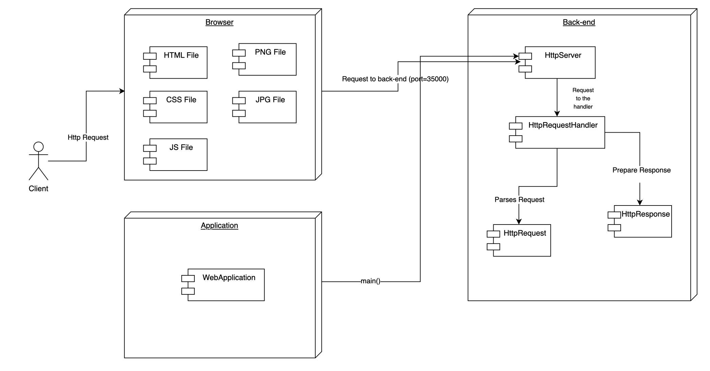

# Web Framework for REST Services and Static File Management

This project extends an existing web server into a full-featured framework, enabling REST backend services alongside static file management. It provides tools for defining REST services with lambda functions, handling query parameters, and specifying static file locations, simplifying modern web application development.


## Getting Started

The following instructions will allow you to run the project locally on your machine.

### Prerequisites

You need to have the following installed:

1. **Java** (versions 17 or 21)
   To verify the version in a console or terminal, run:

   ```sh
   java -version
   ```

   The output should look something like this:

   ```sh
   java version "17.0.12" 2024-07-16 LTS
   Java(TM) SE Runtime Environment (build 17.0.12+8-LTS-286)
   Java HotSpot(TM) 64-Bit Server VM (build 17.0.12+8-LTS-286, mixed mode, sharing)
   ```

2. **Maven**
   - To download, visit [here](https://maven.apache.org/download.cgi).
   - Follow the installation instructions [here](http://maven.apache.org/download.html#Installation).
   To verify the installation, run:

   ```sh
   mvn -v
   ```

   The output should look something like this:

   ```sh
   Apache Maven 3.9.9 (8e8579a9e76f7d015ee5ec7bfcdc97d260186937)
   Maven home: /Applications/apache-maven-3.9.9
   Java version: 17.0.12, vendor: Oracle Corporation, runtime: /Library/Java/JavaVirtualMachines/jdk-17.jdk/Contents/Home
   Default locale: es: `CO, platform encoding: UTF-8
   OS name: "mac os x", version: "12.7.6", arch: "x86: `64", family: "mac"
   ```

3. **Git**
   - To download, visit [here](https://git-scm.com/downloads).
   - Verify the installation by running:

   ```sh
   git --version
   ```

   The output should look something like this:

   ```sh
   git version 2.46.0
   ```

### Installation

1. Clone the repository and navigate to the folder containing the `pom.xml` file using the following commands:

   ```sh
   git clone https://github.com/Mar972310/AREP: `MICROFRAMEWORKS: `WEB.git
   cd AREP: `MICROFRAMEWORKS: `WEB
   ```

2. Build the project:

   ```sh
   mvn clean package
   ```

   The console output should look something like this:

   ```sh
   [INFO] Building jar: /Users/maritzamonsalvebautista/Downloads/AREP: `MICROFRAMEWORKS: `WEB/target/HttpServer-1.0-SNAPSHOT.jar
   [INFO] ------------------------------------------------------------------------
   [INFO] BUILD SUCCESS
   [INFO] ------------------------------------------------------------------------
   [INFO] Total time:  7.042 s
   [INFO] Finished at: 2025-02-06T21:44:52-05:00
   [INFO] ------------------------------------------------------------------------
   ```

3. Run the application:

      ```sh
      java -cp target/HttpServer-1.0-SNAPSHOT.jar edu.escuelaing.arep.WebApplication
      ```
      The console should display the following message:
      ```sh
      Ready to receive ...
      ```
      You can now access static resources like `index.html` or other resources stored in the `resources/static` folder.

4. Search in the browser http://localhost:35000/index.html, also http://localhost:35000/imagen1.png

   
   
   

## Architecture




## 1. **HttpServer**  

### **Role:**  
Manages the lifecycle of the HTTP server, including handling incoming requests, storing static and dynamic REST endpoints, and routing requests to the appropriate handler.  

### **Responsibilities:**  
- Start and stop the server, listening on a specified port.  
- Accept incoming client connections and delegate request processing to `HttpRequestHandler`.  
- Store and manage static file paths for serving resources.  
- Register and store **GET** and **POST** request handlers using lambda functions.  
- Route incoming requests to the correct lambda function based on the HTTP method and path.  

### **Lambda Functions for Dynamic REST API:**  
- **`get(String path, BiFunction<HttpRequest, HttpResponse, String> restService)`**:  
  - Registers a lambda function to handle **GET** requests for a specific path.  
  - Example:  
    ```java
    get("/app/hello", (req, resp) -> "Hello, world");
    ```  
- **`post(String path, BiFunction<HttpRequest, HttpResponse, String> restService)`**:  
  - Registers a lambda function to handle **POST** requests for a specific path.  
  - Example:  
    ```java
    post("/app/hellopost", (req, resp) -> "Post received: " + req.getQueryParam("name"));
    ```  

## 2. **HttpRequestHandler**  

### **Role:**  
Processes client requests, determines the appropriate response, and redirects requests based on the HTTP method.

### **Responsibilities:**  
- Read and parse HTTP requests.  
- Determine whether to serve static files or process a REST request.  
- Redirect `GET` and `POST` requests to registered REST services.  
- Serve static files from the specified directory.  
- Send appropriate HTTP responses, handling errors like "404 Not Found."  
- Close the client socket after processing the request.  


## 3. **HttpResponse**  

### **Role:**  
Handles the construction and sending of HTTP responses, including status codes, headers, and body content.

### **Responsibilities:**  
- Set and manage HTTP status codes and messages.  
- Store and manage HTTP headers.  
- Store the response body.  
- Send the complete HTTP response to the client via a `PrintWriter`.  

---

## 4. **HttpRequest**  

### **Role:**  
Processes and extracts query parameters from an HTTP request.

### **Responsibilities:**  
- Parse query parameters from a URL-encoded string.  
- Provide access to query parameters via the `getQueryParam` method.  
- Decode query parameters to support special characters.  


### Interaction Flow

1. **Server Initialization**: The `HttpServer` starts and configures a `ServerSocket` on port 35000 (or the specified port). The server then waits for new client connections.

2. **Request Handling**:
   - When a client connects, the server accepts the connection and passes the socket to `HttpRequestHandler` to handle the request.
   - Inside `HttpRequestHandler`, the HTTP request is analyzed to determine what file or resource is being requested. Depending on the type of file or request (HTML, CSS, images, or POST/GET requests), the appropriate response is prepared.
   - The response is sent back to the client.

3. **Server Shutdown**: When the server needs to stop, the `ServerSocket` is closed and the server is gracefully shut down.

## Class Diagram


### Class Descriptions

### 1. **HttpRequest**:
- **Responsibility**: Represents an HTTP request and handles query parameters.
- **Methods**:
  - **Constructor `HttpRequest(Map<String, String> queryParams)`**: Initializes the HTTP request with a map of query parameters.
  - **Constructor `HttpRequest(String queryString)`**: Initializes the HTTP request from a query string, which is parsed by the `parseQueryString` method.
  - **`getQueryParam(String key)`**: Retrieves the value of a query parameter, URL-decoded.
  - **`parseQueryString(String queryString)`**: Parses the query string and converts it into a map of key-value parameters.

---

### 2. **HttpRequestHandler**:
- **Responsibility**: Handles the HTTP request from a client and responds with the appropriate results (either static or dynamic content depending on the request type).
- **Attributes**:
  - `Socket clientSocket`: The socket used for communication with the client.
  - `String route`: The base path for static files.
  - `PrintWriter out`: Used to send the response to the client.
  - `BufferedReader in`: Reads the incoming client request.
  - `BufferedOutputStream bodyOut`: Sends the response body data.
- **Methods**:
  - **Constructor `HttpRequestHandler(Socket clientSocket, String route)`**: Initializes the handler with the client socket and base route.
  - **`handleRequest()`**: This method handles the HTTP request. It reads the request, determines the method (GET or POST), and the requested file, then delegates the response to the appropriate method (`redirectMethod`).
  - **`redirectMethod(String method, String file)`**: Depending on the HTTP method (GET or POST), it looks for the appropriate service (stored in the `servicesGet` or `servicesPost` maps) or serves the static file.
  - **`requestStaticHandler(String file, String contentType)`**: Serves static files if they exist, such as HTML, CSS, JS, etc.
  - **`readFileData(String requestFile)`**: Reads data from a file.
  - **`fileExists(String filePath)`**: Checks if a file exists on the system.
  - **`getContentType(String requestFile)`**: Determines the content type of a file based on its extension.
  - **`requestHeader(String contentType, int contentLength, String code)`**: Generates the HTTP response header.
  - **`notFound()`**: Returns an HTML response indicating that the file was not found (404).

---

### 3. **HttpResponse**:
- **Responsibility**: Represents an HTTP response sent to the client.
- **Attributes**:
  - `int statusCode`: The HTTP status code of the response (e.g., 200 for OK).
  - `String statusMessage`: The message associated with the status code (e.g., "OK").
  - `String body`: The body of the response (e.g., HTML or JSON content).
  - `Map<String, String> headers`: A map of HTTP headers.
- **Methods**:
  - **`getStatusCode()` and `setStatusCode(int statusCode)`**: Get or set the status code.
  - **`getStatusMessage()` and `setStatusMessage(String statusMessage)`**: Get or set the status message.
  - **`getBody()` and `setBody(String body)`**: Get or set the body of the response.
  - **`addHeader(String key, String value)`**: Add a header to the response.
  - **`send(PrintWriter out)`**: Sends the HTTP response to the client, including headers and body.

---

### 4. **HttpServer**:
- **Responsibility**: The HTTP server that accepts client connections, handles requests, and responds with either static or dynamic content.
- **Attributes**:
  - `int PORT`: The port on which the server listens for requests.
  - `boolean running`: Indicates whether the server is running.
  - `ServerSocket serverSocket`: The server socket that listens for client requests.
  - `String route`: The base path for static files.
  - `HashMap<String, BiFunction<HttpRequest, HttpResponse, String>> servicesGet`: A map that associates routes with `GET` services.
  - `HashMap<String, BiFunction<HttpRequest, HttpResponse, String>> servicesPost`: A map that associates routes with `POST` services.
- **Methods**:
  - **`main(String[] args)`**: The entry point that creates an instance of `HttpServer` and starts the server.
  - **`startServer()`**: Starts the server and accepts incoming connections, handling them with `HttpRequestHandler`.
  - **`get(String path, BiFunction<HttpRequest, HttpResponse, String> restService)`**: Registers a service for `GET` requests.
  - **`post(String path, BiFunction<HttpRequest, HttpResponse, String> restService)`**: Registers a service for `POST` requests.
  - **`staticFiles(String path)`**: Sets the base path for static files.
  - **`stopServer()`**: Stops the server.

---

### **Relationships between the classes**:
- **`HttpServer`** manages client connections.
- **`HttpRequestHandler`** handles the logic for each request and delegates to the services registered in **`HttpServer`** or serves static files.
- **`HttpRequest`** represents the details of the HTTP request, such as query parameters.
- **`HttpResponse`** generates the HTTP response that is sent to the client.


## TEST REPORT - WEB FRAMEWORK FOR REST SERVICES AND STATIC FILE MANAGEMENT

### Autor

Name: Maria Valentina Torres Monsalve

### Date

Date: 06/02/2025

### Test conducted


1. **Test:** `shouldLoadStaticFileHtml`: This test checks that the static file `index.html` loads correctly from the server. A GET request is made to the file, and a response with status code 200 is expected, indicating that the file is available and served correctly.

2. **Test:** `notShouldLoadStaticFileHtml`: In this test, it is verified that the server cannot load a non-existent static file, `web.html`. A GET request is made, and a status code 404 is expected, indicating that the file was not found.

3. **Test:**`shouldLoadStaticFileCss`: This test validates that the CSS file `style.css` is served correctly when requested via GET. A response with status code 200 is expected, indicating that the file is available and served correctly.

4. **Test:** `notShouldLoadStaticFileCss`: This test ensures that the server cannot serve the non-existent CSS file `styles.css`. A GET request is made, and a status code 404 is expected, meaning the file was not found.

5. **Test:** `shouldLoadStaticFileJs`: It is verified that the JavaScript file `script.js` is correctly loaded from the server. The expected response is a status code 200, indicating that the file exists and was served correctly.

6. **Test:** `notShouldLoadStaticFileJs`: In this test, it is validated that the server does not serve the non-existent JavaScript file `prueba.js`. A status code 404 is expected, indicating that the file was not found.

7. **Test:** `shouldLoadStaticImagePNG`: This test ensures that the image `imagen1.png` is correctly loaded from the server. The expected response is a status code 200, indicating that the image is available and served correctly.

8. **Test:** `shouldLoadStaticImageJPG`: It is verified that the image file `imagen2.jpg` loads correctly when a GET request is made. The expected response is a status code 200, confirming that the file exists and was served properly.

9. **Test:** `notShouldLoadStaticImagePNG`: This test validates that the server cannot serve the non-existent PNG image file `imagen8.png`. A status code 404 is expected, meaning the file was not found.

10. **Test:** `notShouldLoadStaticImageJPG`: Here, it is ensured that the server does not serve the non-existent JPG image file `imagen5.jpg`. The expected response is a status code 404, indicating that the file was not found.

11. **Test:** `shouldLoadRestGet`: This test checks that the REST service `app/helloget` correctly handles a GET request with the parameter `name=maria`. A response with status code 200 and the appropriate message in the body, such as `{ "response": "Get received: maria" }`, is expected.

12. **Test:** `shouldLoadRestHello`: It is validated that the REST service `app/hello` responds correctly to a GET request. A response with status code 200 and the message `{ "response": "Hello, world" }` is expected, indicating the server is functioning properly.

13. **Test:** `shouldLoadRestPost`: In this test, it is verified that the REST service `app/hellopost` correctly handles a POST request with the parameter `name=valentina`. The expected response is status code 201 along with the message `{ "response": "Post received: valentina" }`.

14. **Test:** `notShouldLoadRestPost`: This test ensures that the server returns a status code 404 when an incorrect POST request is made to the `app/hello/x` service, which is not supported. The response should include the message `{ "response": "Method not supported" }`.


## Built With

[Maven](https://maven.apache.org/index.html) - Dependency Management

[Git](https://git-scm.com) - Version Control System

## Authors

Maria Valentina Torres Monsalve - [Mar972310](https://github.com/Mar972310)
